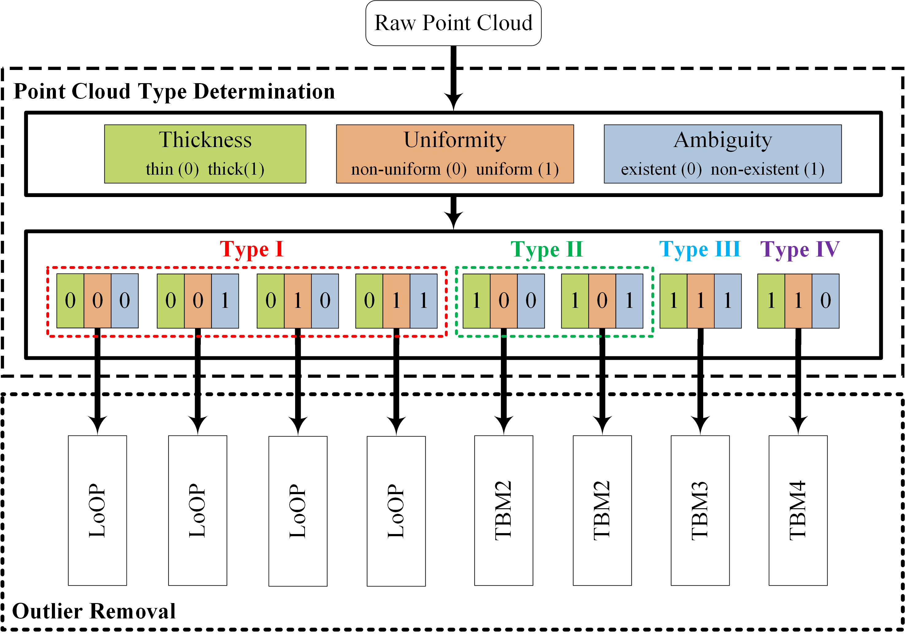

# TBODF: Type-Based Outlier Removal Framework for Point Clouds
This is the source code for the paper "SGODF: A Flexible Style-guided Outlier Detection Framework for Point Cloud". The file structure description of this project is presented in the following.  
```
|--- main.cpp: the entry of the main function.
|--- glib: some basic functions write by myself.
|--- StyleEvaluation.h,.cpp: code for style evaluation.
|--- HybridMethods.h,.cpp : realization for different modules.
|--- python_scripts: this fold contains the point cloud type determination code
```
# Our Framework  

# How to use
## Prerequisities   
* PCL 1.11.1
* VTK 8.2.0
* Eigen 
* OpenMP
```
// step one
// step 1-1: download opencv from https://opencv.org/releases/
// step 1-2: install opencv
# mkdir build
# cd build
# cmake ..
# make -j8
# make install

// step two : install pcl
# sudo add-apt-repository ppa:v-launchpad-jochen-sprickerhof-de/pcl
# sudo apt-get update
# sudo apt-get install libpcl-dev

// step three: install eigen
# sudo apt-get install libeigen3-dev
# sudo cp -r /usr/local/include/eigen3 /usr/include 
```

## Compile  
```
# mkdir build
# cmake ..
# make -j12
```

# Experiments
You can find the comparison methods PMR [1], LoOP [2] and PointCleanNet [3] in the reference section.
# Reference  
[1] https://pdal.io/stages/filters.reciprocity.html  
[2] MeshLab -> Filters -> Selection -> Select Outliers  
[3] https://github.com/mrakotosaon/pointcleannet  